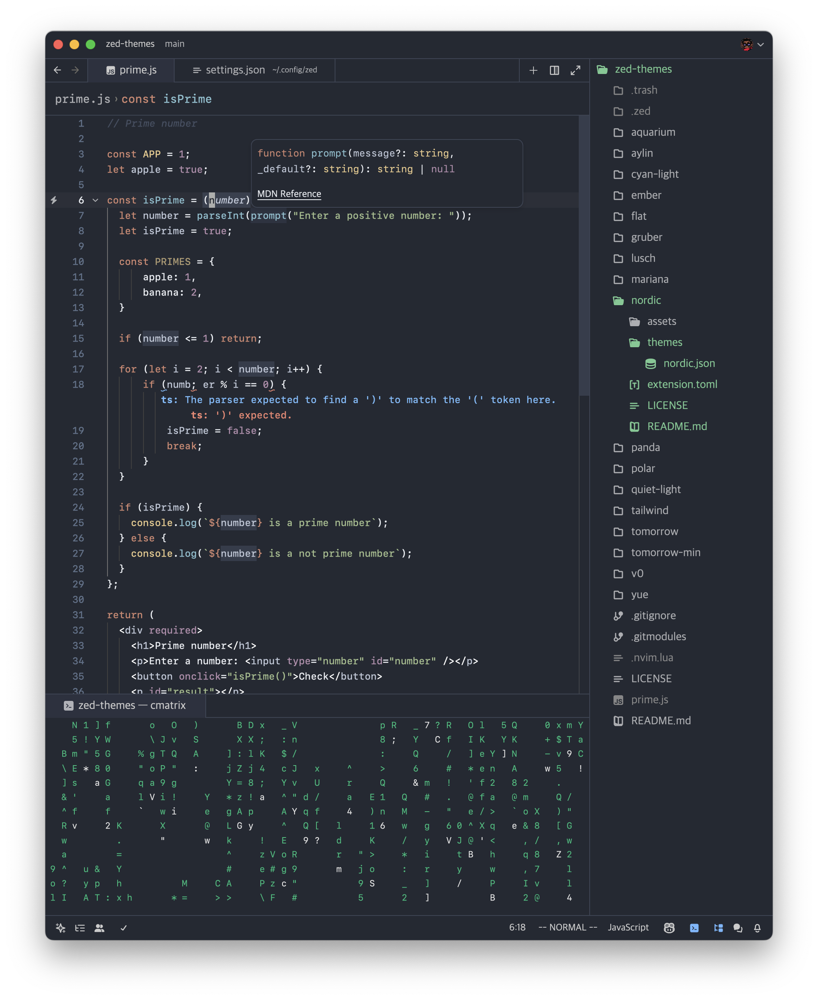

# comboom.sucht (Nordic)
This is a theme in the comboom.sucht color schema in the Nord/Nordic Color pallet.

Simply a [Nordic](https://github.com/bIaqat/nordic-theme-zed) fork
## Preview

## Installation
1. Copy nordic.json to ~/.config/zed/themes/
2. Open Zed and navigate to Settings -> Theme -> Nordic
